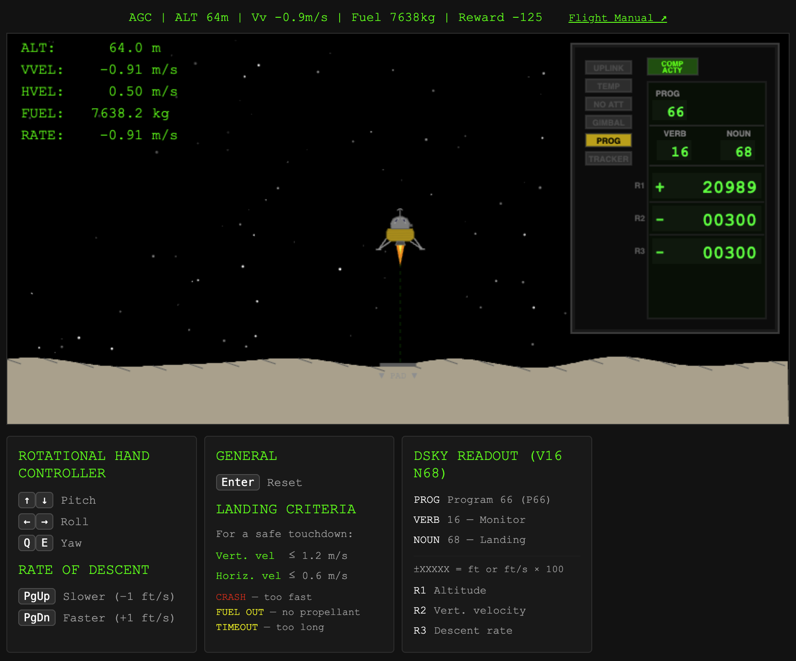

# Apollo Lander



A Python simulation of the Apollo Lunar Module descent, based on the real Apollo 11 [Luminary099](https://github.com/chrislgarry/Apollo-11/tree/master/Luminary099) AGC code. Fly the spacecraft manually using authentic Program 66 controls, or train a reinforcement learning agent to land autonomously.

## Overview

The simulation ports the mathematical logic from the Apollo Guidance Computer into a modern Python environment:

- **RK4 physics engine** with lunar orbital mechanics, thrust, and mass depletion
- **P66 guidance system** replicating the astronaut's actual control interface — Rotational Hand Controller (attitude rates) and Rate of Descent switch (1 ft/s sink rate increments)
- **Gymnasium environment** (`ApolloLander-v0`) for RL training and evaluation
- **Browser-based UI** (Flask + HTML5 Canvas) with 2D side-profile view, HUD, and DSKY-style display

## Quick Start

### Install

```bash
# Clone the repo
git clone https://github.com/yourusername/apollo.git
cd apollo

# Create virtual environment
python -m venv venv
source venv/bin/activate  # Windows: venv\Scripts\activate

# Install core package
pip install -e "."

# Install with all extras (rendering + RL training + dev tools)
pip install -e ".[all]"
```

### Play manually

```bash
apollo play
```

This opens the simulation in your web browser at `http://127.0.0.1:5050`. You control everything the real astronaut controlled — horizontal steering and descent rate — while the AGC handles the throttle and attitude hold automatically.

**Controls:**
| Key | Action |
|-----|--------|
| Arrow keys | Pitch / Roll (Rotational Hand Controller) |
| Q / E | Yaw |
| Page Up | Decrease sink rate (ROD up, −1 ft/s) |
| Page Down | Increase sink rate (ROD down, +1 ft/s) |
| Enter | Reset after game over |

### Assisted mode — focus on steering

```bash
apollo assisted
```

The autopilot handles descent rate scheduling (ROD clicks by altitude), but you must manually steer the LM to null horizontal velocity using the RHC — the hardest part of the Commander's job. This is a good way to learn the controls before going fully manual.

### Watch the AGC autopilot land

```bash
apollo autopilot
```

Everything is automated: the autopilot handles both the descent rate (ROD) and horizontal steering (RHC). This simulates a skilled Commander flying a perfect approach. Watch how it nulls horizontal velocity and schedules the descent profile.

Run headless evaluation:

```bash
apollo autopilot --episodes 20
```

### Train an RL agent

```bash
pip install -e ".[rl]"
apollo train --algo ppo --timesteps 500000
apollo evaluate --model models/apollo_lander --episodes 50
```

### Use as a Gymnasium environment

```python
import apollo_lander.envs
import gymnasium as gym

env = gym.make("ApolloLander-v0")
obs, info = env.reset()

for _ in range(1000):
    action = env.action_space.sample()
    obs, reward, terminated, truncated, info = env.step(action)
    if terminated or truncated:
        obs, info = env.reset()

env.close()
```

## Architecture

```
Agent/Human Input (action)
        │
        ▼
┌─────────────────────────┐
│  Gymnasium Environment  │  ← ApolloLander-v0
│  ┌───────────────────┐  │
│  │ P66 Guidance/DAP  │  │  ← Translates actions → thrust vectors
│  └────────┬──────────┘  │
│  ┌────────▼──────────┐  │
│  │ RK4 Physics Engine│  │  ← Lunar orbital mechanics + mass depletion
│  └───────────────────┘  │
│  → obs, reward, done    │
└─────────────────────────┘
        │
        ▼
  Web UI (Flask)            ← Browser-based Canvas renderer
```

## Project Structure

```
src/apollo_lander/
├── constants.py          # Physical constants (lunar gravity, DPS specs, LM masses)
├── physics.py            # RK4 integrator and equations of motion (7D state vector)
├── transforms.py         # Body ↔ World frame coordinate rotations
├── guidance.py           # P66 guidance: RHC attitude, ROD descent rate, AGC throttle
├── wrappers.py           # FlatActionWrapper for Stable Baselines3 compatibility
├── webapp.py             # Flask web app with REST API
├── renderer.py           # Backward-compat entry point (launches webapp)
├── templates/
│   └── index.html        # HTML5 Canvas game with DSKY panel
├── autopilot.py          # Classical AGC autopilot (non-RL P66 controller)
├── manual.py             # Manual play mode (launches Flask server)
├── train.py              # RL training with PPO/SAC
├── evaluate.py           # Trained model evaluation
├── cli.py                # CLI entry points (apollo play/train/evaluate)
└── envs/
    ├── __init__.py       # Registers ApolloLander-v0
    └── apollo_lander_env.py  # Gymnasium environment
tests/
├── test_physics.py       # Physics engine and RK4 tests
├── test_guidance.py      # P66 controller and coordinate transform tests
├── test_env.py           # Gymnasium environment tests
└── test_cli.py           # CLI tests
```

## How It Works

In the real Apollo 11 landing, the astronaut didn't fly the Lunar Module like a helicopter. They flew **through the computer** using Program 66 (P66):

1. **Rotational Hand Controller (RHC):** A 3-axis joystick that commanded attitude *rates* (not positions). Push forward → the AGC pitches the craft forward at up to 20°/s. Release → the Digital Autopilot fires opposite RCS jets to hold that attitude.

2. **Rate of Descent (ROD) switch:** A spring-loaded toggle. Each click adjusted the AGC's target sink rate by exactly 1 ft/s (0.3048 m/s). The AGC then automatically throttled the Descent Propulsion System to maintain that rate.

3. **Descent Propulsion System (DPS):** The main engine, throttleable from 10% to 100% (4,504 N to 45,040 N). The AGC controlled the throttle — the astronaut never touched it directly.

This simulation replicates exactly that control scheme.

### What the computer controlled vs. what the astronaut controlled

In P66, the division of labor between the AGC and the Commander was very specific:

| | AGC (automated) | Commander (manual) |
|---|---|---|
| **Throttle** | RODCOMP algorithm computed thrust to maintain the commanded descent rate. The astronaut never touched the throttle directly. | — |
| **Attitude hold** | When the RHC was released (center detent), the DAP fired opposing RCS jets to freeze the spacecraft at its current attitude (RCAH mode). | — |
| — | — | **Horizontal steering** — The CDR watched the LPDT cross-pointers (forward/lateral velocity from the landing radar) and manually steered with the RHC to null horizontal velocity and avoid obstacles. |
| — | — | **Descent rate scheduling** — The CDR clicked the ROD switch at specific altitudes to progressively slow the sink rate (−5 ft/s → −3 → −2 → −1 ft/s for final approach). |
| — | — | **Landing site selection** — The CDR could pitch forward/back to redesignate the landing point. Armstrong famously did this on Apollo 11 to avoid a boulder field. |

The three play modes map to this division of labor:

| Mode | You control | Computer controls |
|---|---|---|
| `apollo play` | RHC + ROD (full astronaut experience) | Throttle + attitude hold |
| `apollo assisted` | RHC only (horizontal steering) | Throttle + attitude hold + ROD scheduling |
| `apollo autopilot` | Nothing (observe) | Everything |

## Running Tests

```bash
pytest                    # Run all 35 tests
pytest -v                 # Verbose output
pytest tests/test_physics.py  # Physics tests only
```

## Dependencies

| Group | Packages |
|-------|----------|
| Core | numpy, scipy, gymnasium, click |
| Web UI | flask |
| RL Training | stable-baselines3, tensorboard |
| Development | pytest, pytest-cov, ruff, black, mypy |

## Documentation

- [docs/project.md](docs/project.md) — Project overview and specifications
- [docs/ground_truths.md](docs/ground_truths.md) — Key findings and design decisions

## License

BSD 3-Clause License — see [LICENSE](LICENSE) for details.
